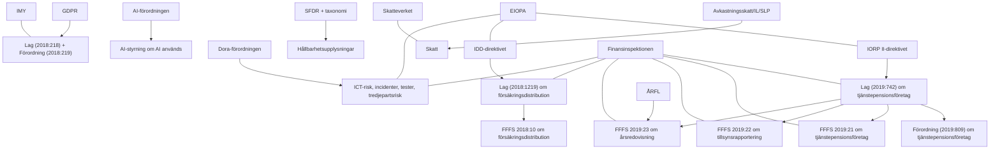
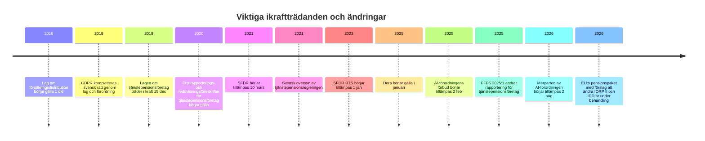

# Regelverkskarta för svenska tjänstepensionsbolag

## Sammanfattning

Det centrala rättsliga ramverket för ett svenskt **tjänstepensionsföretag** är inte Solvens II som huvudregim, utan **lagen (2019:742) om tjänstepensionsföretag**, **förordningen (2019:809) om tjänstepensionsföretag** samt Finansinspektionens sektorregler i **FFFS 2019:21**, **FFFS 2019:22** och **FFFS 2019:23**. Det svenska regelverket genomför i huvudsak **IORP II-direktivet** och lägger ovanpå detta svenska krav på bland annat tillstånd, företagsstyrning, centrala funktioner, kapitalbas, riskkänsligt kapitalkrav, minimikapitalkrav, försäkringstekniska avsättningar, skuldtäckning, information till försäkrade och löpande tillsynsrapportering. citeturn26search2turn46search2turn46search0turn12search14turn31view1turn32view2turn33view3turn12search0turn6search1

I praktiken måste ett tjänstepensionsbolag dessutom nästan alltid förhålla sig till ett tvärgående lager av regler: **IDD/Lagen om försäkringsdistribution** om bolaget distribuerar egna produkter eller lämnar råd, **Dora** för ICT-risk, incidentrapportering, digital motståndskraft och tredjepartsrisker, **GDPR** för personuppgifter, **SFDR** och i relevanta delar **taxonomiförordningen** för hållbarhetsupplysningar, samt svenska specialregler för redovisning och skatt. **AI-förordningen** gäller inte därför att bolaget är ett tjänstepensionsföretag, utan därför att bolaget använder eller tillhandahåller AI; i försäkringsnära användning kan den bli särskilt skarp om AI används i högriskfall som riskbedömning eller prissättning i liv- och sjukförsäkring. citeturn47view2turn47view3turn42search0turn42search1turn37view3turn38search6turn38search28turn39search5turn18search0turn18search3turn24view3turn25search5turn17search0turn8search2turn8search9

Två vanliga felklassificeringar är viktiga att undvika. För det första: **ren kärnverksamhet enligt lagen om tjänstepensionsföretag omfattas normalt inte av penningtvättslagen på samma sätt som livförsäkringsrörelse**, eftersom den svenska AML-lagen uttryckligen undantar verksamhet som avser tjänstepensionsförsäkring enligt LTF från den berörda försäkringskategorin. För det andra: **K3 är inte den normala huvudregimen för externredovisningen i ett tjänstepensionsföretag**; den praktiska huvudregimen är i stället **lagen om årsredovisning i försäkringsföretag** tillsammans med **FFFS 2019:23**, där FI anger att företag bör tillämpa godkända IFRS och RFR 2 med sektorspecifika anpassningar. citeturn4view0turn6search0turn20view0

Min tillförlitlighetsbedömning är **hög** för kärnreglerna i svensk och EU-rätt, **hög** för Dora/GDPR/SFDR/IDD, **medelhög** för exakt svensk myndighetsfördelning under **AI-förordningen** eftersom IMY uttryckligen anger att flera myndigheter har föreslagits som behöriga men att det **ännu inte finns några beslut** i Sverige. citeturn8search6turn8search10

## Regelverkets struktur och gränsdragningar

Nedan är den praktiska regelhierarkin för ett svenskt tjänstepensionsbolag. EU-direktiv ligger bakom stora delar av den svenska primärrätten, medan direkt tillämpliga EU-förordningar lägger sig ovanpå den svenska sektorsregleringen. För tjänstepensionsföretag är Finansinspektionen den centrala nationella tillsynsmyndigheten, med EIOPA som den centrala EU-myndigheten för pensions- och försäkringskonvergens. För personuppgifter är IMY tillsynsmyndighet, och för skatt är Skatteverket det centrala kontrollorganet. citeturn26search2turn46search2turn37view3turn18search3turn19search1

Den viktigaste gränsdragningen gäller **Solvens II**. Ett företag som faktiskt har **tillstånd som tjänstepensionsföretag enligt LTF** ligger normalt inte under Solvens II som sin huvudsakliga prudensregim. Solvens II är däremot fortsatt relevant som jämförelsemodell, som källa till vissa begrepp och FRL-hänvisningar, och för försäkringsföretag som bedriver tjänstepensionsrelaterad verksamhet under försäkringsrörelselagen i stället för som omvandlat tjänstepensionsföretag. Det innebär att en koncern kan behöva hantera **både LTF-regim och Solvens II-regim parallellt**, men på olika juridiska enheter. citeturn26search13turn43search1turn32view4turn26search12

Det som ofta kallas **”Pillar 3”** finns för tjänstepensionsföretag, men inte i exakt samma offentlighetsarkitektur som under Solvens II. I praktiken består motsvarigheten av FI:s kvantitativa och kvalitativa tillsynsrapportering enligt **FFFS 2019:22**, rapportering av egen risk- och solvensbedömning enligt **FFFS 2019:21**, offentlig information till försäkrade via **pensionsbesked**, samt årsredovisning och vissa styrningsupplysningar. Det är därför mer korrekt att beskriva ramen som **”IORP II/LTF-rapportering och disclosure”** än som Solvens II-pelare i strikt mening. Detta är en tolkning av hur reglerna fungerar i praktiken, baserad på de svenska rapporterings- och informationskraven. citeturn12search0turn11view0turn34view2turn33view3turn33view0

Tidslinjen nedan visar de datum som i praktiken styr de flesta complianceprogrammen i svenska tjänstepensionsbolag. citeturn46search16turn46search4turn12search0turn6search1turn24view3turn37view3turn8search2turn12search12turn41search1

## Det bindande kärnregelverket

*Obs.* För svenska SFS- och FFFS-akter finns normalt ingen auktoritativ officiell engelsk titel i samma mening som på EUR-Lex. De engelska titlarna nedan är därför deskriptiva översättningar, medan den svenska beteckningen är den rättsligt styrande.

**Europaparlamentets och rådets direktiv (EU) 2016/2341 om verksamhet i och tillsyn över tjänstepensionsinstitut / Directive (EU) 2016/2341 on the activities and supervision of institutions for occupational retirement provision.** Detta är det EU-direktiv som utgör grunden för den svenska tjänstepensionsregimen. För ett svenskt tjänstepensionsbolag är det inte direkt tillämpligt som förordning, utan genomfört främst genom **LTF**, **förordningen (2019:809)** och FI:s föreskrifter. I praktiken betyder direktivet att bolaget måste ha god styrning, investera prudently, lämna information till medlemmar/försäkrade och stå under specialiserad prudensiell tillsyn. **Tillsyn:** Finansinspektionen nationellt; EIOPA på EU-nivå för convergence och vägledning. **Praktiskt exempel:** mappa varje IORP II-artikel mot LTF/FFFS och säkerställ att inget EU-krav saknar svensk kontrollägare. citeturn26search2turn46search4turn12search14

**Lag (2019:742) om tjänstepensionsföretag / Act on Occupational Pension Companies.** Detta är huvudlagen. Den kräver tillstånd för verksamheten, förbjuder annan verksamhet än tjänstepensionsverksamhet och därmed sammanhängande verksamhet, kräver att bolaget drivs med tillfredsställande soliditet, likviditet och kontroll, ålägger bolaget att lämna information och årliga pensionsbesked, ställer krav på försäkringstekniska avsättningar och skuldtäckning, fordrar en tillräcklig kapitalbas samt ett riskkänsligt kapitalkrav och minimikapitalkrav, och kräver centrala funktioner för riskhantering, regelefterlevnad, internrevision och aktuarie samt en dokumenterad egen risk- och solvensbedömning. **Tillsyn:** Finansinspektionen. **Ikraftträdande:** 15 december 2019. **Senare ändringar:** bland annat 2021 års översyn av regelverket. **Praktiskt exempel:** årlig ORSA-process, styrelsefastställda investeringsriktlinjer, kapitalplanering och årlig utskickshantering för pensionsbesked. citeturn46search2turn46search4turn31view1turn31view2turn31view4turn32view2turn32view3turn33view3

**Förordning (2019:809) om tjänstepensionsföretag / Ordinance on Occupational Pension Companies.** Förordningen kompletterar LTF och gäller uttryckligen för tjänstepensionsföretag enligt lagen. I praktiken används den som nationell genomförandeförordning, bland annat för detaljfrågor där lagtexten lämnar bemyndiganden. **Tillsyn:** Finansinspektionen tillämpar regelverket; regeringen är normgivare. **Praktiskt exempel:** kontrollera om en viss rapporterings-, dispens- eller associationsrättslig detalj hanteras i förordningen snarare än i lagen. citeturn46search0turn46search7

**Finansinspektionens föreskrifter och allmänna råd (FFFS 2019:21) om tjänstepensionsföretag / FI Regulations and General Guidelines on Occupational Pension Companies.** Detta är det viktigaste svenska sekundärregelverket i den löpande driften. Det preciserar bland annat **fit and proper**, styrelsens samlade kompetens, behörighetskrav för den ansvariga aktuarien, innehåll i styrdokument för riskhantering, rapportering av ORSA till FI, informationskrav före avtal och i pensionsbesked, samt krav för uppdragsavtal/outsourcing. Reglerna kräver till exempel att bolaget granskar ledningspersoners **ärlighet, ekonomiska ställning, utbildning och erfarenhet**, att styrelsen samlat har rätt kompetens, att ORSA-rapporten innehåller kvalitativa och kvantitativa resultat samt jämförelse mellan solvensbehov, kapitalkrav och kapitalbas, och att väsentliga outsourcingavtal innehåller revisionsrätt, åtkomst, exit, underleverantörsvillkor och FI-samarbete. **Tillsyn:** Finansinspektionen. **Praktiskt exempel:** upprätta en outsourcingklausulstandard som innehåller alla punkter i 69–71 §§ och kör årlig lämplighetsprövningsdokumentation för styrelse, VD och funktionsansvariga. citeturn36view0turn36view2turn11view0turn11view1turn34view0turn34view1turn34view2

**Finansinspektionens föreskrifter och allmänna råd (FFFS 2019:22) om tillsynsrapportering för tjänstepensionsföretag / FI Regulations and General Guidelines on Supervisory Reporting for Occupational Pension Companies.** Dessa föreskrifter gäller uttryckligen för tjänstepensionsföretag och kräver både kvantitativ och kvalitativ rapportering till FI för nationell och EU-relaterad tillsyn. De anger vilka uppgifter som ska lämnas och när års- och kvartalsrapporter ska komma in. FI ändrade föreskrifterna genom **FFFS 2025:1**, med påverkan på både kvartals- och årsrapportering, mot bakgrund av ändrade krav från EIOPA. **Tillsyn:** Finansinspektionen; EIOPA styr indirekt taxonomi och dataformat. **Ikraftträdande:** 1 januari 2020. **Senaste ändring:** 23 april 2025. **Praktiskt exempel:** håll en rapporteringskalender med dataägare för resultat, balans, kapital, gränsöverskridande verksamhet och EIOPA-taxonomi/Fidac-valideringar. citeturn12search0turn12search6turn12search12turn26search9

**Lag (1995:1560) om årsredovisning i försäkringsföretag tillsammans med FFFS 2019:23 / Annual Accounts in Insurance Undertakings Act together with FI accounting regulations.** Ett tjänstepensionsföretag redovisar inte enligt ”vanlig ÅRL/K3-logik” som huvudspår, utan enligt den särskilda svenska årsredovisningslagen för försäkringsföretag och FI:s särskilda redovisningsföreskrifter. I **FFFS 2019:23** anger FI att företag bör tillämpa godkända IFRS om inte lag eller annan författning kräver annat, samt att företag bör tillämpa **RFR 2**; noterade företag och koncerner påverkas dessutom av **IAS-förordningen**. Praktiskt innebär detta att redovisningsfrågor som kontraktsklassificering, verkligt värde, förvaltningsfastigheter, pensionsplaner, konsolideringsfond och delårsrapportering måste lösas inom den särskilda försäkrings-/tjänstepensionsramen. **Tillsyn:** Finansinspektionen; Bolagsverket för registrering och offentliggörande av årsredovisning. **Ikraftträdande för FFFS 2019:23:** 1 januari 2020. **Praktiskt exempel:** gör en redovisningspolicy som uttryckligen anger ÅRFL + FFFS 2019:23 + IFRS/RFR 2, och behandla K3 endast som bakgrundsreferens – inte som huvudregelverk. citeturn6search0turn6search1turn20view0

**Solvens II-direktivet 2009/138/EG / Solvency II Directive.** För ett faktiskt LTF-licensierat tjänstepensionsbolag är Solvens II **normalt inte** den direkt tillämpliga huvudsakliga prudensregimen. Relevansen ligger i stället i att LTF använder flera Solvens II-liknande byggstenar – kapitalbas, riskkänsligt kapitalkrav, ORSA-liknande bedömning, gruppsolvensliknande struktur och delvis harmoniserad rapporteringslogik – och att svenska försäkringsföretag som inte är omvandlade tjänstepensionsföretag ligger under Solvens II/FRL i stället. **Tillsyn:** Finansinspektionen respektive EIOPA inom sina områden. **Praktiskt exempel:** separera regelinventeringen på juridisk person-nivå om koncernen innehåller både försäkringsföretag och tjänstepensionsföretag. citeturn26search13turn43search1turn26search12turn43search4

## Tvärgående krav och sektorspecifika områden

**Lagen (2018:1219) om försäkringsdistribution och IDD-paketet / Insurance Distribution Act and IDD package.** Om ett tjänstepensionsföretag distribuerar tjänstepensionsförsäkring eller lämnar rådgivning, träffas det av den svenska distributionslagen som definierar **tjänstepensionsförsäkring** och lägger krav på god försäkringsdistributionssed, kundens bästa, lämplighetsbedömning, ersättningskontroll, kunskap och kompetens, klagomålshantering och **intern process för produktgodkännande** med målgrupp och distributionsstrategi. För **försäkringsbaserade investeringsprodukter** tillkommer IDD:s delegerade förordningar **(EU) 2017/2358** om POG och **(EU) 2017/2359** om information och conduct of business; genom **(EU) 2021/1257** integreras hållbarhetspreferenser i rådgivningen. Övergångsbestämmelsen i den svenska lagen anger särskilt att 7 kap. 1 § skulle börja tillämpas på distribution av tjänstepensionsförsäkring från 1 oktober 2019. **Tillsyn:** Finansinspektionen; EIOPA för viss vägledning. **Praktiskt exempel:** dokumentera målgrupp, negativ målgrupp, distributionskanaler, incitamentsanalys och rådgivningsmall för hållbarhetspreferenser. citeturn47view0turn47view2turn47view3turn46search16turn42search9turn42search1turn42search0turn42search16turn25search18

**Konsumentskydd, information och klagomål / Consumer protection, information and complaints.** I den löpande relationen med försäkrade bygger konsumentskyddet i praktiken på flera lager: LTF:s krav på information och årligt pensionsbesked, **FFFS 2019:21** med detaljer om innehållet i pensionsbeskedet och information före avtal, **FFFS 2011:39** om information som gäller försäkring och tjänstepension, **FFFS 2002:23** om klagomålshantering avseende finansiella tjänster till konsumenter, samt **EIOPA:s riktlinjer för försäkringsföretags hantering av klagomål**. FI konstaterade i sin tillsynsrapport att klagomålshantering kräver styrdokument, beslutsordning, uppföljning, rapportering till styrelsen och tydlig extern information om hur kunden klagar och vart kunden kan vända sig vidare. Som civilrättslig bakgrund är **försäkringsavtalslagen (2005:104)** relevant, och för kollektivavtalsgrundad försäkring finns uttryckligt utrymme för avvikelser genom centrala överenskommelser. **Tillsyn:** Finansinspektionen; Allmänna reklamationsnämnden och domstolar för tvister; EIOPA för riktlinjer. **Praktiskt exempel:** publicera klagomålsansvarig, klagomålsprocess och vägledning till Hallå Konsument/Konsumenternas Försäkringsbyrå, och säkerställ att pensionsbesked visar premier, avgifter, kapitalavkastning, riskpremie och prognosvarning. citeturn33view3turn34view1turn34view2turn48view0turn49search3

**Dora-förordningen och tillhörande tekniska standarder / DORA and its technical standards.** **Förordning (EU) 2022/2554** gäller enligt FI i stort sett alla företag under FI:s tillsyn från januari 2025 och innebär nya krav på ICT-riskhantering, rapportering av ICT-relaterade incidenter, digital operativ motståndskraft, resiliensprovning och ICT-tredjepartsrisker. För tjänstepensionsföretag är Dora därför den praktiska huvudregimen för **outsourcing/cloud/ICT resilience** när den utlagda funktionen är ICT-baserad. De viktigaste kompletterande EU-akterna i praktiken är **Kommissionens delegerade förordning (EU) 2024/1772** om klassificering av ICT-incidenter och rapportinnehåll, **Kommissionens delegerade förordning (EU) 2024/1773** om policy för ICT-tjänster som stödjer kritiska eller viktiga funktioner, **Kommissionens delegerade förordning (EU) 2025/301** om innehåll och tidsfrister för incidentrapporter, samt **Kommissionens genomförandeförordning (EU) 2024/2956** om standardmallar för informationsregistret. EIOPA meddelade i december 2024 att äldre ICT- och cloud-outsourcingriktlinjer drogs tillbaka för att undvika dubbelreglering med Dora. **Tillsyn:** Finansinspektionen nationellt; ESAs/EIOPA och lead overseers på EU-nivå. **Praktiskt exempel:** skapa ett fullständigt register över ICT-leverantörer, klassificera kritiska/viktiga funktioner, uppdatera avtalsmallar med Dora-klausuler och sätt upp en incidentprocess som klarar initial, mellanliggande och slutlig rapport. citeturn37view3turn38search28turn38search5turn39search5turn38search6turn45search2turn45search8

**GDPR, lag (2018:218) och förordning (2018:219) / GDPR and Swedish supplementary law.** Dataskyddsreglerna gäller fullt ut för tjänstepensionsföretag eftersom verksamheten i hög grad bygger på behandling av personuppgifter om anställda, försäkrade, förmånstagare och ofta känsliga uppgifter. Den svenska kompletteringslagen och kompletteringsförordningen gäller tillsammans med GDPR, och **IMY är tillsynsmyndighet**. IMY anger att dataskyddsombud krävs för privata organisationer om kärnverksamheten består i regelbunden och systematisk övervakning i stor omfattning eller omfattande behandling av känsliga uppgifter; IMY har uttryckligen granskat bland annat försäkringsbolag i detta avseende. Vid automatiserat beslutsfattande eller profilering som får rättsliga eller liknande betydande effekter krävs typiskt **DPIA**. **Praktiskt exempel:** dokumentera rättslig grund för pensionsadministration, teckna personuppgiftsbiträdesavtal med administrations- och molnleverantörer, bedöm om DPO och DPIA krävs, och skapa rutiner för registerutdrag, gallring och incidentanmälan. citeturn18search0turn18search3turn18search1turn18search9turn18search2

**AI-förordningen / AI Act.** **Förordning (EU) 2024/1689** trädde i kraft den 1 augusti 2024; enligt IMY började reglerna om förbjudna AI-användningar gälla den 2 februari 2025 och så gott som hela förordningen börjar gälla den 2 augusti 2026. För tjänstepensionsföretag gäller AI-förordningen **rollbaserat**: den blir relevant om bolaget är leverantör, distributör eller användare av AI-system. En särskilt viktig träffyta för försäkringsnära verksamhet är att AI-system för **riskbedömning och prissättning i liv- och sjukförsäkring** återfinns i den högrisklogik som AI-akten bygger på. Den svenska myndighetsfördelningen är däremot ännu inte slutligt beslutad; IMY anger att flera myndigheter har föreslagits få uppgifter, men att det ännu inte finns några beslut. **Tillsyn:** EU:s AI Office för vissa centrala uppgifter; framtida svenska behöriga myndigheter ännu inte slutligt beslutade. **Praktiskt exempel:** gör en AI-inventering, klassificera användningsfall, stoppa förbjudna användningar, lägg in human oversight och logging, och koppla AI-styrningen till dataskydd, modellrisk och Dora. citeturn17search0turn17search1turn8search2turn8search6turn8search9turn8search10

**Penningtvättslagen / AML.** Här är svaret ovanligt viktigt: kärnverksamhet som avser tjänstepensionsförsäkring enligt LTF är **normalt inte direkt träffad** av lagen **(2017:630) om åtgärder mot penningtvätt och finansiering av terrorism** på samma sätt som livförsäkringsrörelse och vissa försäkringsförmedlare. Den svenska lagtexten om berörda verksamhetsutövare gör ett uttryckligt undantag för verksamhet som avser tjänstepensionsförsäkring enligt LTF. Det betyder att ett rent tjänstepensionsföretag inte automatiskt ska bygga ett AML-program på samma premisser som en bank eller ett livbolag, men det måste ändå göra en **juridisk scope-kontroll** för att säkerställa att ingen separat verksamhet eller koncernfunktion träffas. **Tillsyn:** om täckt verksamhet finns, typiskt Finansinspektionen för berörda finansiella företag. **Praktiskt exempel:** dokumentera i compliance-matrisen varför LTF-kärnverksamheten ligger utanför AML-lagens scope, och gör en separat bedömning för eventuella förmedlings- eller sidoverksamheter. citeturn4view0turn3search1

**SFDR och taxonomiförordningen / SFDR and Taxonomy Regulation.** FI anger uttryckligen att **tjänstepensionsföretag** är en kategori av **finansmarknadsaktörer** som omfattas av **SFDR**, och att förordningen kräver hållbarhetsupplysningar på webbplats, i förköpsinformation och i regelbundna rapporter. SFDR började tillämpas den 10 mars 2021 och **RTS-förordningen (EU) 2022/1288** började tillämpas den 1 januari 2023. När bolaget marknadsför pensionsprodukter som artikel 8- eller artikel 9-produkter blir taxonomiförordningen praktiskt viktig för hur miljömål och andelar av hållbara investeringar ska beskrivas. **Tillsyn:** Finansinspektionen; EIOPA/ESA Joint Committee för vägledning och Q&A. **Praktiskt exempel:** håll uppdaterad webbplatsinformation om hållbarhetsrisker, principal adverse impacts, produktklassificering, och säkerställ att förköps- och årsrapporter använder RTS-mallarna korrekt. citeturn24view3turn7search4turn25search5turn7search12

**Skatteregler / Tax rules.** De centrala svenska skattereglerna är **lagen (1990:661) om avkastningsskatt på pensionsmedel**, där skattesatsen i lagen kan vara 15 eller 30 procent beroende på underlag/produktkategori, **inkomstskattelagen (1999:1229)**, där tjänstepensionsföretag skatterättsligt likställs med försäkringsföretag, samt reglerna om **särskild löneskatt på pensionskostnader**, som däremot normalt ligger på den arbetsgivare som utfäst tjänstepensionen och inte på tjänstepensionsföretaget som sådant. **Tillsyn/kontroll:** Skatteverket. **Praktiskt exempel:** säkerställ att bolaget deklarerar avkastningsskatt korrekt, att redovisningen stödjer skatteunderlaget, och att arbetsgivarkunder får rätt information om SLP som ligger utanför bolagets egen skatt men påverkar produkt- och avtalsstrukturen. citeturn19search0turn19search2turn19search3turn19search8turn19search16

**Modellrisk, governance och investeringsstyrning / Model risk, governance and investment governance.** Det finns ingen egen fristående svensk ”modellriskförordning” för tjänstepensionsföretag. I praktiken hanteras modellrisk genom LTF:s krav på riskhanteringssystem, ORSA, aktuariefunktion, aktsam beräkning av försäkringstekniska avsättningar, fit and proper, internkontroll och Dora/GDPR/AI vid digitala modeller. Denna slutsats följer av hur de olika regelverken griper in i varandra. Ett aktuellt exempel på hur FI tillämpar styrnings- och riskkontrollskraven i praktiken är Alecta-beslutet från mars 2026, där FI bedömde att företaget hade brustit i riskkontroll och investeringar. **Praktiskt exempel:** ha en modellinventering, oberoende validering, tydlig modellägare, dokumenterade antaganden, styrelserapportering och eskaleringstriggers när modeller används för kapital, liability projections, ALM eller produktprognoser. citeturn31view0turn31view2turn32view3turn36view0turn37view3turn18search2turn17search0turn45search7

## Jämförande tabell

| Regelverk | Räckvidd | Gäller för svenskt tjänstepensionsbolag? | Status i Sverige | Fem viktigaste skyldigheter i praktiken | Tillsyn | Datum och ändringsläge | Källa |
|---|---|---|---|---|---|---|---|
| **IORP II + LTF + förordning 2019:809** | Huvudregim för tillstånd, styrning, kapital, avsättningar, information | **Ja, fullt ut** | Direktiv transponerat i svensk lag/förordning | Tillstånd; centrala funktioner; ORSA; kapitalbas/kapitalkrav; pensionsbesked | FI, med EIOPA-konvergens | LTF från 2019-12-15; svensk översyn 2021; ytterligare ändringar därefter | citeturn26search2turn46search2turn46search0turn46search4turn26search4 |
| **FFFS 2019:21** | Detaljkrav för governance, information, outsourcing, ORSA, fit & proper | **Ja, fullt ut** | Svensk sekundärreglering | Lämplighetsprövning; styrelsekompetens; ORSA-rapport; pensionsbesked; outsourcingklausuler/uppföljning | FI | Del av reformpaketet 2019/2020; ändringar bl.a. 2020 och 2021 | citeturn36view0turn11view0turn11view1turn34view1turn34view2 |
| **FFFS 2019:22** | Tillsynsrapportering till FI | **Ja, fullt ut** | Svensk sekundärreglering | Kvartals- och årsrapport; kvalitativ rapportering; rätt tidsfrister; EIOPA-taxonomi; datakvalitet/validering | FI | Gäller från 2020-01-01; ändrad genom FFFS 2025:1 från 2025-04-23 | citeturn12search0turn12search12turn26search9 |
| **ÅRFL + FFFS 2019:23 + IAS-förordningen/RFR 2** | Extern redovisning och koncernredovisning | **Ja, fullt ut** | Svensk speciallag + direkt EU-förordning för IFRS där tillämpligt | Årsredovisning enligt ÅRFL; IFRS/RFR 2 med FI-anpassningar; verkligt värde; kontraktsklassificering; delårsrapportering | FI, Bolagsverket | FFFS 2019:23 från 2020-01-01; IAS-förordningen gäller direkt | citeturn6search0turn6search1turn20view0 |
| **Solvens II** | Försäkringsföretagens prudensregim | **Normalt nej som huvudregim** | Direktiv för försäkringsföretag; relevant via gränsdragning och jämförelse | Korrekt entity-klassificering; undvik regelblandning; beakta FRL-hänvisningar; koncernkartläggning; rapporteringsseparering | FI, EIOPA | Fortsatt relevant för FRL-företag; inte kärnregim för LTF-företag | citeturn26search13turn43search1turn26search12turn43search4 |
| **IDD + lagen om försäkringsdistribution + FFFS 2018:10 + delegerade IDD-ak­ter** | Conduct, rådgivning och produktstyrning vid distribution | **Ja, när bolaget distribuerar produkter eller ger råd** | Direktiv transponerat i svensk lag/föreskrifter; delegerade EU-förordningar gäller direkt | God distributionssed; lämplighet/avrådan; incitament; POG/målgrupp; hållbarhetspreferenser för IBIP-råd | FI, EIOPA | Svensk lag från 2018-10-01; vissa regler för tjänstepension från 2019-10-01; hållbarhet sedan 2022 | citeturn47view0turn47view2turn47view3turn42search0turn42search1turn42search9 |
| **LTF/FFFS 2011:39/FFFS 2002:23/EIOPA klagomålsriktlinjer** | Konsumentskydd, information, klagomål | **Ja** | Svensk rätt och tillsynsstandarder | Klagomålspolicy; klagomålsansvarig; webbplatsinformation; uppföljning till styrelse; korrekt kundinformation | FI, EIOPA | FFFS 2002:23 sedan 2003; EIOPA-riktlinjer sedan 2012 | citeturn48view0turn34view2turn33view3 |
| **Dora + RTS/ITS** | ICT-risk, incidenter, tester, outsourcing/cloud | **Ja, fullt ut** | Direkt tillämplig EU-förordning och tekniska standarder | ICT-riskramverk; incidentrapportering; resiliensprovning; tredjepartsrisk; register över ICT-avtal | FI, ESAs/EIOPA | Dora gäller från januari 2025; flera RTS/ITS finaliserades 2024–2025 | citeturn37view3turn38search28turn38search5turn39search5turn38search6 |
| **GDPR + lag 2018:218 + förordning 2018:219** | Personuppgifter och integritet | **Ja, fullt ut** | Direkt tillämplig EU-förordning med svensk komplettering | Rättslig grund; registerutdrag/rättigheter; DPO där kriterierna uppfylls; DPIA; personuppgiftsbiträdesavtal | IMY | Gäller sedan 2018; svensk kompletteringslag/förordning samma år | citeturn18search0turn18search3turn18search1turn18search2turn18search9 |
| **AI-förordningen** | Tvärsektoriell AI-reglering | **Ja, om bolaget använder eller tillhandahåller AI** | Direkt tillämplig EU-förordning; svensk komplettering under uppbyggnad | Förbjudna användningar; klassificera AI-system; högriskkrav där relevant; human oversight; dokumentation/loggning | EU AI Office + framtida svenska myndigheter | Förbud sedan 2025-02-02; merparten börjar gälla 2026-08-02; svensk myndighetsfördelning ännu inte beslutad | citeturn17search0turn8search2turn8search6turn8search10 |
| **AML-lagen** | Penningtvätt/FOT | **Normalt inte för ren LTF-kärnverksamhet** | Svensk lag; scope måste bedömas verksamhet för verksamhet | Scope-analys; bedöm om täckt sidoverksamhet finns; om ja: riskbedömning; kundkännedom; rapportering/träning | FI där verksamheten omfattas | Kärnverksamhet enligt LTF undantas i relevant försäkringskategori | citeturn4view0turn3search1 |
| **SFDR + taxonomiförordningen** | Hållbarhetsupplysningar på företags- och produktnivå | **Ja, normalt** | Direkt tillämpliga EU-förordningar | Webbplatsupplysningar; förköpsinformation; periodiska rapporter; PAI-ställningstagande; taxonomiandelar där relevant | FI, ESA/EIOPA | SFDR från 2021-03-10; RTS från 2023-01-01 | citeturn24view3turn7search4turn25search5turn7search12 |
| **Avkastningsskatt/IL/SLP** | Sektorspecifik skatt | **Ja, men med olika skat­tebärare** | Svensk skattelagstiftning | Deklarera avkastningsskatt; rätt skatteklassificering; redovisningsstöd för underlag; hantera arbetsgivarnas SLP-frågor; avtalsspegling i produkter | Skatteverket | Långvarigt gällande; LTF-företag likställdes skatterättsligt med försäkringsföretag 2019 | citeturn19search0turn19search2turn19search3turn19search8 |

## Primärkällor och bevakade förändringar

De viktigaste primärkällorna att ha som **förstahandskällor** i ett internt compliancebibliotek är följande. Citeringarna nedan går till officiella eller tillsynsnära källor.

- **Riksdagens SFS-text för lag (2019:742) om tjänstepensionsföretag** – grundkällan för tillstånd, styrning, kapital, information, grupptillsyn och ingripanden. citeturn46search2turn31view1turn32view2turn33view3
- **Förordning (2019:809) om tjänstepensionsföretag** – central komplettering till LTF. citeturn46search0
- **FFFS 2019:21** – operativ kärnkälla för governance, information, ORSA, fit & proper och outsourcing. citeturn36view0turn11view1turn34view2
- **FFFS 2019:22** – kärnkälla för rapportering till FI. citeturn12search0turn12search12
- **FFFS 2019:23** – kärnkälla för årsredovisning i tjänstepensionsföretag. citeturn6search1turn20view0
- **EUR-Lex-texten för IORP II-direktivet** – EU-ursprunget för den svenska tjänstepensionsregimen. citeturn26search2
- **Lagen om försäkringsdistribution och IDD:s delegerade förordningar** – kärnkällor för produktstyrning, rådgivning och kundskydd vid distribution. citeturn47view2turn42search0turn42search1
- **FI:s sida om Dora och de antagna Dora-RTS/ITS** – kärnkällor för ICT-risk, cloud och outsourcing av kritiska ICT-funktioner. citeturn37view3turn38search28turn38search5turn39search5turn38search6
- **GDPR + svensk kompletteringslag/-förordning + IMY:s vägledningar** – kärnkällor för personuppgifter, DPO och DPIA. citeturn18search0turn18search3turn18search1turn18search2
- **FI:s SFDR-sida** – tydlig svensk myndighetskälla för att tjänstepensionsföretag omfattas av hållbarhetsupplysningsreglerna. citeturn24view3
- **Skatteverkets och riksdagens källor om avkastningsskatt, IL och SLP** – kärnkällor för de viktigaste skattefrågorna. citeturn19search0turn19search2turn19search3

De mest relevanta **pågående eller nyligen ändrade** frågorna att bevaka är följande.

För det första har FI ändrat tillsynsrapporteringen för tjänstepensionsföretag genom **FFFS 2025:1**, vilket direkt påverkar datafält, års- och kvartalsrapportering och interna rapporteringskalendrar. citeturn12search12

För det andra ligger ett nytt **EU-pensionspaket** under behandling. Regeringens faktapromemoria beskriver **COM(2025) 842**, ett förslag till direktiv som ska ändra **IORP II** och **IDD** för att stärka ramen för occupational retirement provision. Det är den viktigaste externa förändringssignalen för svenska tjänstepensionsbolag på medellång sikt. citeturn41search1turn41search3

För det tredje är **AI-förordningen** i en övergångsfas. IMY uppger både att de flesta bestämmelser börjar gälla den 2 augusti 2026 och att det finns förslag inom ett omnibuspaket om att senarelägga vissa delar, samtidigt som den svenska myndighetsfördelningen ännu inte är beslutad. Det gör AI till det mest osäkra området i den här rapporten – inte om förordningen finns, utan om den svenska tillsynsstrukturen och de praktiska gränssnitten mot befintlig finansreglering. citeturn8search2turn8search6turn8search10

För det fjärde har **Dora** redan ersatt mycket av den tidigare mjukare ICT-guidningen i försäkrings- och pensionssektorn; EIOPA drog i december 2024 tillbaka äldre ICT- och cloud-outsourcingriktlinjer för att undvika överlappning. Om ett tjänstepensionsbolag fortfarande lutar sig på äldre EIOPA-ICT-policys i stället för Dora-styrning, finns det ett tydligt uppdateringsbehov. citeturn45search2turn37view3

Den kortaste praktiska slutsatsen är därför denna: ett svenskt tjänstepensionsbolag bör ha sin compliance-arkitektur byggd kring **LTF-paketet**, **IDD-paketet där distribution förekommer**, **Dora**, **GDPR**, **SFDR**, **specialredovisningen** och **skatt**, samtidigt som **Solvens II** och **AML** hanteras som noggranna gränsdragningsfrågor snarare än som automatiska huvudregimer för den rena tjänstepensionsrörelsen. citeturn46search2turn47view2turn37view3turn18search0turn24view3turn6search0turn19search0turn4view0turn26search13